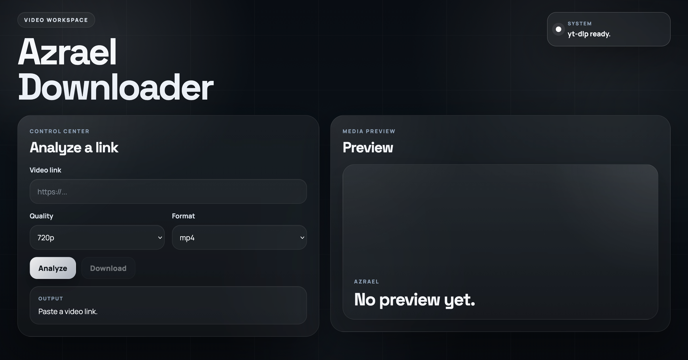

# Azrael Downloader

Direct web UI for analyzing video links and downloading browser-supported media.



## Stack

- Angular 20
- Spring Boot 3
- `yt-dlp`
- `ffmpeg`

## Requirements

- Java 21
- Maven
- Node.js + npm
- `yt-dlp`
- `ffmpeg`

## Run

### macOS launcher

```bash
./start-java-springboot-angular.command
```

### Manual

Backend:

```bash
cd java-springboot-angular/backend
mvn spring-boot:run
```

Frontend:

```bash
cd java-springboot-angular/frontend
npm install
npm start
```

App: `http://localhost:4200`  
API: `http://localhost:8080`

## What It Does

- analyzes a video URL
- shows title, thumbnail, duration, views, and uploader
- lists only direct browser-downloadable resolutions
- downloads on the client side
- shows dependency status for `yt-dlp` and `ffmpeg`

## Limits

- no fake 1080p options
- no server-side file jobs
- no manifest-only `m3u8` download handoff
- if a source does not expose a direct media URL, that resolution is hidden

## API

- `POST /api/videos/analyze`
- `GET /api/system/dependencies`

## Project

```text
java-springboot-angular/
├── backend/
└── frontend/
```
